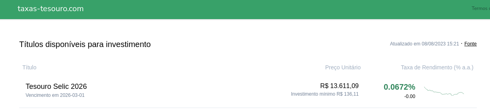

# scrapy-exercise
Objetivo desse execício é praticar fundamentos de WebScraping e familiarizar-se com o framework 
[Scrapy](https://scrapy.org/).

## Instruções para o exercício:
1. Você não está sozinho, se encontrar alguma dificuldade busque a resposta, mas se perceber que não
está progredindo, me mande uma mensagem.
2. Procure fazer commits com frequência, é sempre melhor vários pequenos commits do que um commit enorme.
    * Seja descritivo no texto do commit
3. Não tenha pressa, faça quando for possível, o objetivo é praticar e desenvolver.
4. Faça um log paralelo, em texto ou markdown, registrando data e hora que comecou a trabalhar no 
exercício e data e hora que parou. Inclua uma breve menção do que foi feito nesse período. 
    * Isso vai me ajudar a estimar quanto tempo uma determinada tarefa vai levar e a identificar em
    que você precisa reforçar.
    * Não se preocupe em ser muito preciso, nem em "*estou levando muito tempo em X*", isso é apenas 
    uma estimativa.
    * Exemplo de entrada:
        ```
        20/10 16h as 18h -> Escrevi as funções de processamento dos dados
        21/10 13h as 13:30h -> Testei e corrigi bug na função que processa datas.
        ```

## Requisitos do exercício
1. Utilização do Scrapy para a raspagem dos dados.
2. Seguir o esquema e formatos apresentados em `Especificações técnicas -> Item 4`
3. Fazer a transmissão de dado *relevante* entre páginas num framework assíncrono.
4. Permitir a filtragem de items raspados através de argumento arbitrário e utilizando um `ItemPipeline`.

## Especificações técnicas
1. Acessar o site [https://taxas-tesouro.com/](https://taxas-tesouro.com/)
2. Extrair e armazenar da página inicial a informação `"Atualizado em {DATA} {HORA}"` encontrada no
canto superior direito da página.
    * Essa informação estará disponível em outras páginas do site, para fins do exercício extrair o
    dado da página inicial.

    
3. Acessar a página de detalhamento de cada uma das linha do campo `Títulos disponíveis para investimento`,
as linhas do campo `Resgate` **devem** ser ignoradas.
4. Extrair da página de detalhamento as informações do título, incluíndo seus dados históricos
presentes no gráfico. **Cada entrada no gráfico deve ser considerado um item individual**.
    * Em cada item extraído pelo spider, os campos devem estar presentes:
        ```
        treasure_bond_title: str          # Nome do título
        expiration_date: str              # Vencimento do título, em formato YYYY-MM-DD
        record_date: datetime             # Data e hora em que o título foi observado
        interest_rate: float              # Taxa de rendimento oferecida na data hora que consta em "record_date"
        bond_was_last_updated_at: str     # Valor de "Atualizado em" extraído da página inicial em formato ISO ajustado para UTC-0
        ```
    * Observar bem os comentários acima, pois definem formatação dos dados.
    * O campo `bond_was_last_updated_at` será o mesmo valor em todos os itens e deve armazenar o
    valor extraído na página inicial mencionado no item 2.
5. O spider deve ser capaz de trabalhar de forma incremental, isto é, se passado um argumento na
execução o spider deve dropar todos os itens com `record_date` anterior ao argumento.
    * Para fins de **exercício** realizar essa filtragem através de um `ItemPipeline`.

## Bônus
* **Se quiser ir além:** Crie testes unitários para o projeto. Testes unitários são utilizados para
garantir que determinadas funções executam como esperado.
    * Python inclui por padrão um framework chamado [unittest](https://docs.python.org/3/library/unittest.html)
    * Scrapy inclui uma *feature* chamada [Spider Contracts](https://docs.scrapy.org/en/latest/topics/contracts.html) com finalidade similar.
    * Uma outra forma de se testar Scrapy Spiders é descrita [aqui](https://stackoverflow.com/a/12741030)
    * **Exemplos acima são apenas sugestões.**


## Links uteis para o exercício:
- https://docs.scrapy.org/en/latest/topics/developer-tools.html

- https://docs.scrapy.org/en/latest/topics/dynamic-content.html

- https://docs.scrapy.org/en/latest/topics/request-response.html#scrapy.http.Request.cb_kwargs

- https://docs.scrapy.org/en/latest/topics/item-pipeline.html#topics-item-pipeline

### SPIDER EXECUTION INSTRUCTIONS

# Open a terminal at the root of project;
* Run Spider:
    - type in terminal: **scrapy crawl treasure_bonds**, then press ENTER;

* Store scraped data into an archive:
    - Type in terminal: **scrapy crawl treasure_bonds -O <archive_name>.<archive_format>**, then press ENTER (format example: .json | .csv);

* Filter escraped data based on a cutoff date:
    - Type in terminal: **scrapy crawl treasure_bonds -a filter_date='yyyy-mm-dd hh:mm:ss'**, then press ENTER.